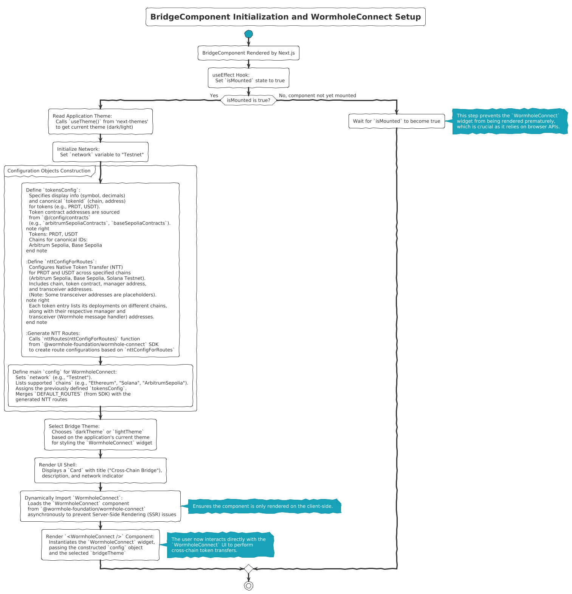

# Peridot Finance - Decentralized Cross-Chain Finance Platform

[](https://opensource.org/licenses/MIT)

Peridot Finance is a cutting-edge decentralized finance (DeFi) platform built with Next.js, offering users a seamless experience for cross-chain token bridging, lending, and borrowing. The platform is designed to be transparent, accessible, and secure, leveraging the power of blockchain technology and prominent DeFi protocols.

## ✨ Core Features

*   **Cross-Chain Token Bridging:** Powered by **Wormhole Connect**, enabling users to transfer assets across various blockchain networks (e.g., Ethereum, Solana, Arbitrum Sepolia, Base Sepolia) efficiently.
*   **DeFi Lending & Borrowing:** Allows users to supply their crypto assets to earn interest or borrow funds against their collateral. The platform aims to provide competitive rates and robust risk management.
*   **User Communication:**
    *   **Contact Form:** A dedicated system for users to reach out to the Peridot team with inquiries.
    *   **Email Subscriptions:** Users can subscribe to newsletters for updates, articles, and insights about Peridot and the DeFi space.
*   **User Interaction Tracking:** Integrated with **PostHog** for analytics, helping to understand user behavior and improve the platform experience.

## 🛠️ Key Technologies

*   **Frontend:** Next.js (App Router), React, TypeScript, Tailwind CSS, Shadcn/UI
*   **Blockchain Integration:**
    *   Wormhole Connect SDK for cross-chain bridging.
    *   Ethers.js / Viem / Wagmi (likely, based on typical DeFi dApp structure for wallet interactions and contract calls - verify specific usage).
*   **Backend (API Routes):** Next.js API Routes, Node.js
*   **Email Services:** Nodemailer (for contact form submissions)
*   **Analytics:** PostHog (Client-side and Server-side)
*   **Database:** PostgreSQL (for email subscriptions)
*   **Styling:** Tailwind CSS, CSS Modules (globals.css)
*   **UI Components:** Custom components, Shadcn/UI, Lucide Icons, Framer Motion for animations.

## 📂 Project Structure

The project is primarily located within the `defi-platform` directory:

```
defi-platform/
├── app/                  # Next.js App Router (pages, layouts, API routes)
│   ├── (main)/           # Main application routes
│   ├── api/              # Backend API endpoints (contact, subscribe)
│   │   ├── contact/
│   │   └── subscribe/
│   ├── bridge/           # Bridge page
│   ├── contact/          # Contact page
│   ├── layout.tsx        # Root layout
│   └── page.tsx          # Main landing page
├── components/           # Shared React components
│   ├── bridge/           # Bridge specific components
│   │   └── BridgeComponent.tsx
│   ├── ui/               # UI primitives (likely from Shadcn/UI)
│   ├── PostHogProvider.tsx # PostHog integration
│   ├── SiteHeader.tsx
│   ├── SiteFooter.tsx
│   └── SubscribePopup.jsx
├── config/               # Configuration files (e.g., contract addresses)
│   └── contracts.ts      # (Assumed name for contract details)
├── context/              # React Context API for global state
├── hooks/                # Custom React hooks
├── lib/                  # Utility functions and libraries
│   ├── utils.ts
│   └── posthog.ts        # PostHog server-side client
├── public/               # Static assets (images, fonts)
├── styles/               # Global styles (though Tailwind is primary)
├── types/                # TypeScript type definitions
├── next.config.mjs       # Next.js configuration
├── tailwind.config.ts    # Tailwind CSS configuration
├── tsconfig.json         # TypeScript configuration
├── package.json          # Project dependencies and scripts
└── README.md             # This file
```

## 🔗 Core Components & Integrations

### 1. BridgeComponent & Wormhole Connect

The `BridgeComponent.tsx` (located in `defi-platform/components/bridge/`) is central to the platform's cross-chain bridging functionality. It integrates the `@wormhole-foundation/wormhole-connect` SDK to provide a user-friendly interface for token transfers.




**Integration Flow:**

1.  **Client-Side Mount:** The component ensures it's mounted on the client-side before rendering `WormholeConnect`.
2.  **Theme Adaptation:** Dynamically adapts its theme (dark/light) based on the application's global theme settings.
3.  **Configuration:**
    *   `tokensConfig`: Defines the tokens available for bridging (e.g., PRDT, USDT), including their symbols, decimals, icons, and canonical identifiers (chain and address). Contract addresses are sourced from `config/contracts.ts`.
    *   `nttConfigForRoutes`: Configures Native Token Transfer (NTT) routes, specifying token deployments on different chains, their manager contracts, and transceiver (Wormhole message handler) addresses.
    *   Main `config` object: This is passed to `WormholeConnect` and includes:
        *   Network (e.g., "Testnet").
        *   Supported chains (e.g., "Ethereum", "Solana", "ArbitrumSepolia").
        *   The `tokensConfig`.
        *   Combined routes from `DEFAULT_ROUTES` (SDK) and custom NTT routes generated by `nttRoutes(nttConfigForRoutes)`.
4.  **Dynamic Import:** `WormholeConnect` is dynamically imported to prevent SSR issues and ensure it only runs on the client.
5.  **Rendering:** The configured `WormholeConnect` widget is rendered, allowing users to select source/destination chains, connect wallets, and initiate transfers.

*(For a detailed visual representation of this flow, a UML activity diagram has been conceptualized and can be generated using PlantUML with the provided syntax from previous discussions.)*

### 2. Lending & Borrowing Platform

Peridot Finance serves as a DeFi lending and borrowing platform. Users can:
*   Supply assets to liquidity pools to earn interest.
*   Borrow assets by providing collateral.
The platform aims to ensure security through measures like over-collateralization and robust price oracle systems, as detailed on the `/security` page.

*(Further details on specific smart contracts, interest rate models, and liquidation mechanisms would require deeper dives into the backend and smart contract codebase, which is not fully visible here.)*

### 3. Contact & Subscription System

*   **Contact Form:**
    *   Frontend: `app/contact/page.tsx` provides the UI.
    *   Backend: `app/api/contact/route.js` handles form submissions, using `nodemailer` to send emails to `peridotprotocol@gmail.com`.
*   **Email Subscription:**
    *   Component: `components/SubscribePopup.jsx` offers a modal for users to subscribe.
    *   Backend: `app/api/subscribe/route.js` saves subscriber emails to a PostgreSQL database.

### 4. PostHog Analytics

User interactions and page views are tracked using PostHog for product analytics.
*   **Client-Side:** `components/PostHogProvider.tsx` wraps the application, initializing `posthog-js` with `NEXT_PUBLIC_POSTHOG_KEY` and sending events to `/ingest` (proxied to PostHog's API host).
*   **Server-Side:** `lib/posthog.ts` likely provides a PostHog Node.js client instance for server-side event tracking if needed.

## ⚙️ Configuration

The platform relies on several environment variables for its core functionalities:

*   `NEXT_PUBLIC_POSTHOG_KEY`: Public key for PostHog client-side integration.
*   `NEXT_PUBLIC_POSTHOG_HOST`: PostHog API host (e.g., `https://us.posthog.com` or your self-hosted instance).
*   `EMAIL_USER`: Gmail username for sending contact form emails.
*   `EMAIL_PASSWORD`: Gmail password (or app password) for the `EMAIL_USER`.
*   **Database Credentials (for PostgreSQL used by `app/api/subscribe/route.js`):**
    *   `POSTGRES_HOST`
    *   `POSTGRES_PORT`
    *   `POSTGRES_DATABASE`
    *   `POSTGRES_USER`
    *   `POSTGRES_PASSWORD`

Ensure these are set up in your `.env.local` file for local development.

## 🚀 Getting Started

### Prerequisites

*   Node.js (version specified in `.nvmrc` if available, or latest LTS)
*   pnpm (or npm/yarn, though `pnpm-lock.yaml` is present)
*   Access to a PostgreSQL database (for the subscription feature)
*   PostHog account and API keys (for analytics)
*   Gmail account credentials (for the contact form)

### Installation

1.  **Clone the repository:**
    ```bash
    git clone <repository-url>
    cd defi-platform
    ```

2.  **Install dependencies:**
    ```bash
    pnpm install
    # or npm install / yarn install
    ```

3.  **Set up environment variables:**
    Create a `.env.local` file in the `defi-platform` directory and populate it with the necessary keys and credentials (see Configuration section above).
    Example `.env.local`:
    ```env
    NEXT_PUBLIC_POSTHOG_KEY=your_posthog_public_key
    NEXT_PUBLIC_POSTHOG_HOST=https://us.posthog.com
    EMAIL_USER=your_gmail_address@gmail.com
    EMAIL_PASSWORD=your_gmail_app_password

    POSTGRES_HOST=localhost
    POSTGRES_PORT=5432
    POSTGRES_DATABASE=peridot_db
    POSTGRES_USER=your_db_user
    POSTGRES_PASSWORD=your_db_password
    ```

### Running Locally

1.  **Ensure your PostgreSQL database is running and accessible.**
2.  **Start the development server:**
    ```bash
    pnpm dev
    # or npm run dev / yarn dev
    ```
    The application should now be accessible at `http://localhost:3000`.

## 📜 Scripts

The `package.json` in the `defi-platform` directory contains various scripts for development, building, and linting. Common scripts include:

*   `dev`: Starts the Next.js development server.
*   `build`: Builds the application for production.
*   `start`: Starts the production server (after building).
*   `lint`: Lints the codebase (e.g., using ESLint, Prettier).

Refer to the `scripts` section in `defi-platform/package.json` for a full list.

## ☁️ Deployment

*   The application is built as a standard Next.js project and can be deployed to any platform that supports Node.js and Next.js (e.g., Vercel, Netlify, AWS Amplify, self-hosted Docker).
*   Ensure all necessary environment variables are configured on the deployment platform.
*   The PostHog ingest endpoint (`/ingest`) might need specific proxy configuration depending on the deployment platform if you're not using PostHog Cloud's direct ingestion.

## 🤝 Contributing

Contributions are welcome! Please follow the standard fork-and-pull-request workflow. Ensure your code adheres to the project's linting standards and all tests pass.
(Further details on contribution guidelines can be added here).

## 📄 License

This project is licensed under the MIT License. See the [LICENSE](LICENSE.md) file for details (assuming a LICENSE.md file will be created or exists).

---

This README provides a comprehensive overview of the Peridot Finance platform. Further refinements can be made as new features are added or existing ones evolve. 